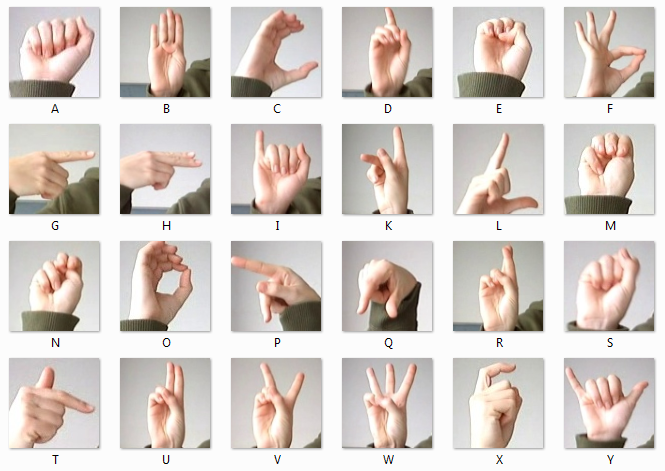

# mnist-american-sign-language

<p align="center">
    
</p>

Using <a href="https://www.kaggle.com/datamunge/sign-language-mnist/">this kaggle dataset</a> to train a **Convulational Neural Network (CNN)** in order to classify images with sign language letters. This model could be used for a computer vision application.

## How to run the script
1. Create a virtual environment:
```sh
python -m venv venv
```
2. Activate the virtual environment: <br>
if in windows:
```sh
venv\Scripts\activate.bat
```
if in linux:
```sh
source venv/bin/activate
```
3. Install the mandatory libraries to run the script:
```sh
pip install -r requirements.txt
```